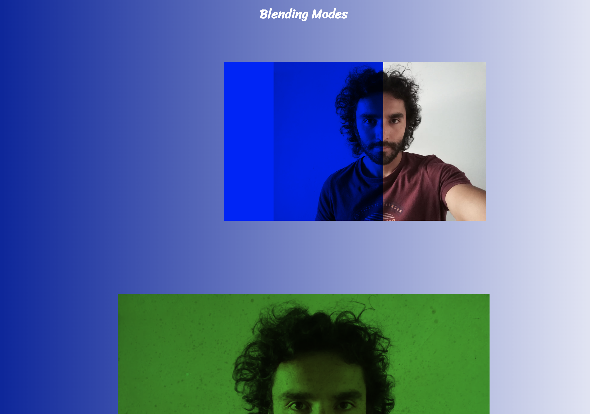

# BlendingModes-CSS
This repo is made for learning purposes, the topic is the properties in CSS to blend images and elements. If you want to play and see the results of blending modes fork the repo and in the assets folder change the file model.jpg for a selfie of you showing the different results(don’t change the name model.jpg) would be great to see how these modes work in different faces and also would be a great opportunity to master the knowledge.

# Pet Shooping Web Page

## Built With

- HTML,
- CSS,

## Live Demo

[Live Demo Link](https://raw.githack.com/javierbotero/BlendingModes-CSS/master/index.html)

### Setup: Just fork the project and you will have a copy of the repo or

### download the files and start making nice changes!.

## Authors

👤 **Javier Botero**

- Github: [@githubhandle](https://github.com/javierbotero)
- Twitter: [@twitterhandle](https://twitter.com/JavierBotero1)
- Linkedin: [linkedin](https://www.linkedin.com/in/javier-botero-044686155/)

## 🤝 Contributing

Contributions, issues and feature requests are welcome!

Feel free to check the [issues page](issues/).

## Show your support

Give a ⭐️ if you like this project!
